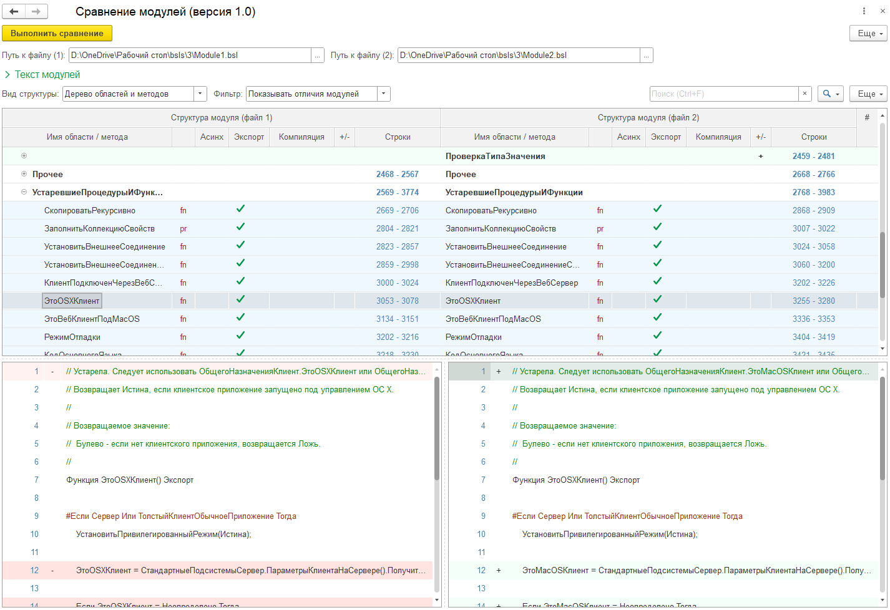

# Обработка для сравнения модулей в режиме 1С:Предприятие

Обработка предназначеня для сравнения кода в режиме 1С:Предприятие без использования внешних компонент.

## Возможности
* построение структуры модуля (дерево областей и методов)
* фильтр изменений (измененные, добавленные, удаленные и т.д.)
* переключение режима просмотра списка методов (дерево, таблица)
* подсветка наличия изменений, добавленных и удаленных областей / методов
* информация об Асинх, Экспорт и директиве компиляции в списке методов
* информация о типе метода (pr - процедура, fx - функция)
* построчное сравнение текстов модулей

## Планируемые доработки 
* анализ изменений без привязки к методам (например комментарии в коде)
* возможность открыть каталог выгрузки конфигурации и подбирать файлы для сравнения из него
* трехстороннее сравнение (но это не точно)

## Дополнительная информация
* Минимальная версия платформы 8.3.18 (используются методы Асинх)
* Алгоритм построчного сравнения реализован на базе [разработки с Инфостарт](https://infostart.ru/public/581384/). Автор: Игорь Пашутин
* Немного подсматривал в [обработку сравнения модулей](https://infostart.ru/public/453716/) Андрея Овсянкина ([на Github](https://github.com/EvilBeaver), [на Инфостарт](https://infostart.ru/profile/267027/))

Прикручивать консоль кода не планирую, если кто возьмется и сделает, буду благодарен и выложу измененную версию. Хотя не вижу смысла пока в этом. Цель была сделать именно сравнение без использования доп. средств (некоторый спортивный интерес).

Ну и да, я в курсе про наличие kdiff и др. программ для сравнения, но они тоже внешние, а штатное сравнение работает только в толстом клиенте или через Меню - Сравнить файлы, что несколько неудобно. Да и структуру модуля не показывает.
  
## Чуток подробностей

### Методика сравнения
* Сначала программа обрабатывает тексты модулей и "забивает" все комментарии и строковые значения (символом #), а так же заменяет ";"
* После подготовки текста программа строит таблицы областей и методов (см. режим отладки)
* После подготовки таблиц областей и методов, на основании их данных строится структура модуля (в зависимости от настроек)
* При активизации строки метода, программа выполняет построчное сравнения и заносит данные в таблицы слева и справа

Важно: Построчное сравнение выполняется один раз, при повторной активизации строки накладывается фильтр

### Известные недостатки
* Не учитывает объявление нового метода следом за закрытием предыдущего. Например: "КонецПроцедуры Процедура Имя()"
* Сравнение построчное. Внутри строки различия не анализируются и не подсвечиваются
* В некоторых случаях программа некорректно определяет блоки изменений

### Быстродействие
* Тестировалось на модулях 4-6 тысяч строк. При наличии разделения на методы (Процедура, Функция) сравнение выполняется достаточно быстро
* Предполагается, что тексты отдельных методов не будут превышать 1000 строк. Иначе из-за особенностей реализации методики построчного сравнения, расчет различий может выполняться длительное время
* Построчный анализ различий не выполняется до момента активизации строки метода в структуре модуля. При повторной активизации, анализ не выполняется, просто накладывается фильтр на таблицы

### Про батарейки
В обработке используются некоторые процедуры из общих модулей БСП. Обратите внимание "batteries not included", поэтому рекомендую открывать в конфигурациях, основанных на БСП. Выпилить возможно, но для меня не актуально.

Использованные объекты из БСП:
* ОМ.ОбщегоНазначения
* ОМ.ОбщегоНазначенияКлиент
* ОМ.ОбщегоНазначенияКлиентСервер
* ОМ.СтроковыеФункцииКлиентСервер
* ОМ.ФайловаяСистемаКлиент